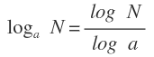

# Binary Search
Es un algoritmo de búsqueda eficiente que consiste en dividir una lista ordenada repetidamente a la mitad la parte que podria contener el elemento buscado, hasta reducir la ubicaciones posibles a una sola.

```
Para una lista de 8 números se tendrá que examinar como máximo 3 números
    log(2) 8 = 3

Para una lista de 2,539,913 números se tendrá que examinar como máximo 22 números
    log(2) 2,539,913 = 21.27635
```

# Notas

Fórmula para cambio de base

